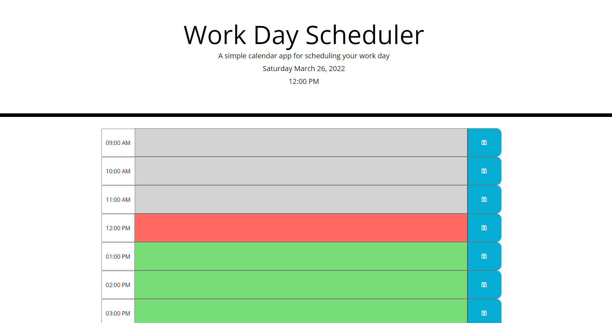

# 05 Third-Party APIs: Work Day Scheduler

## Project Description

Starter code includes a fully completed style.css file along with partially completed index.html file. The Script.js will need to be started from [Scratch] and include JQuery Moment.js within to create a functioning Work Day Scheduler.

## What is Used
    * Style.css
    * index.html
    * script.js
    * JQuery
    * Moment.js

## Main Objection

The main objective is to create a simple calendar application that allows a user to save events for each hour of the day by modifying starter code. This app will run in the browser and feature dynamically updated HTML and CSS powered by jQuery.

Use [Moment.js](https://momentjs.com/) library to work with date and time in the browser.

## How to Use the Project

✅ The opened Daily Planner will have the current day displayed at the top

✅ Planner shows standard business hours with timeblocks for each hour.

✅ Each timeblock is color coded to indicated whether it is in the past, present, or future.

✅ When a timeblock is clicked an event can be added and saved in local storage.

✅ When the page is refreshed the saved events continue to be saved.

## Live URL
https://cynthiagodoy.github.io/Work-Day-Scheduler/

## Screenshot

- - -
© 2021 Trilogy Education Services, LLC, a 2U, Inc. brand. Confidential and Proprietary. All Rights Reserved.